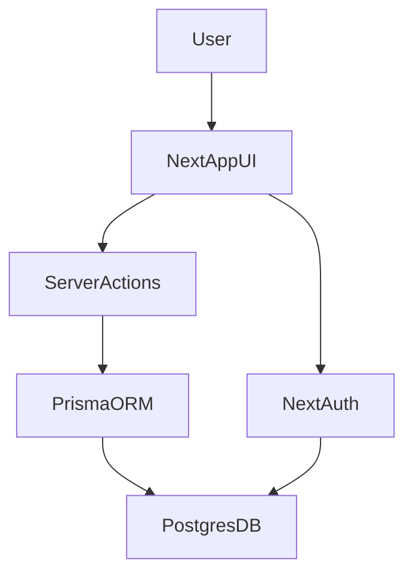

## Architecture (simple and deep)

Think of the app as 3 layers:
1) UI (pages and components)
2) Server actions (save and fetch)
3) Database (Prisma + PostgreSQL)

If you understand these 3 layers, you can build this again.

### High-level diagram

### What each layer does
- UI: renders forms and tables. Example: `app/(app)/patients/page.tsx`.
- Server actions: run on the server and talk to the database.
- Database: stores real data. Schema lives in `prisma/schema.prisma`.

### Why this is "job-ready"
Most real SaaS apps use this structure:
- a UI layer
- a service layer (server actions / APIs)
- a database
- auth + roles
- dashboards and admin tools

### Where auth sits
Auth is global and protects routes:
- `middleware.ts` blocks access to dashboard routes.
- `lib/rbac.ts` checks roles and permissions inside pages.

### Plain-English summary
You type into a form -> the server saves data -> the page shows the new data.
That is the core loop of this whole app.

### Reference docs (for this exact stack)
- Next.js App Router: https://nextjs.org/docs/app
- Server Actions: https://nextjs.org/docs/app/building-your-application/data-fetching/server-actions
- Prisma schema: https://www.prisma.io/docs/orm/prisma-schema
- PostgreSQL basics: https://www.postgresql.org/docs/
