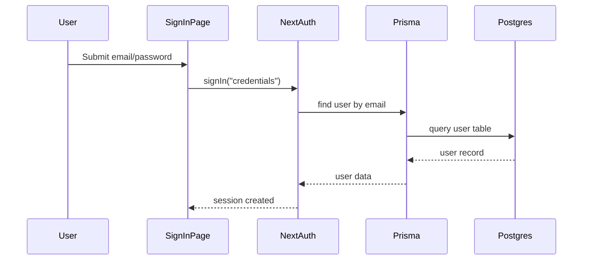

## Auth + RBAC (simple but complete)

Auth = who you are.  
RBAC = what you are allowed to do.

### Where auth lives
- `lib/auth.ts` configures NextAuth
- `app/api/auth/[...nextauth]/route.ts` is the API endpoint
- `app/signin/page.tsx` is the login page

### How login works
1) User submits email + password.
2) NextAuth calls `authorize` in `lib/auth.ts`.
3) We compare the password hash.
4) If correct, session is created.

### Diagram

### RBAC basics
RBAC rules are checked in `lib/rbac.ts`:
- `requireAuth()` checks login
- `requireRole("admin")` checks role
- `requirePermission("patients.write")` checks permission

### Why we do both
Login alone is not enough.
Example: a nurse should not see admin settings.

### How permissions are stored
Permissions live in the database:
- `Role` has many `Permission`
- `User` has many `Role`

### Practice tasks
- Add a new permission key in `prisma/seed.ts`
- Require it on a page using `requirePermission`

### Reference docs
- NextAuth (v4): https://next-auth.js.org/
- NextAuth Credentials: https://next-auth.js.org/providers/credentials
- Middleware: https://nextjs.org/docs/app/building-your-application/routing/middleware
