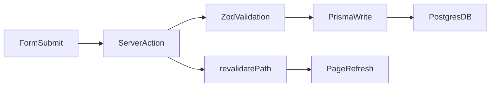

## Data flow (how data moves)

You will see this exact flow everywhere in the app.

### Step-by-step flow
1) User fills a form in the browser.
2) The form submits to a server action.
3) The server action validates input.
4) The server action writes to Prisma.
5) The page revalidates and shows the new data.

### Diagram

### Real example in this project
File: `app/(app)/patients/page.tsx`
- `createPatient` is a server action.
- It validates with `patientSchema`.
- It saves with `prisma.patient.create`.
- Then calls `revalidatePath("/patients")`.

### Fetching data (read)
We fetch directly inside page functions:
- `const patients = await prisma.patient.findMany(...)`

This runs on the server, so it is safe and fast.

### Why server actions
They remove the need for separate API routes for simple CRUD.
It is still secure because the code runs on the server, not in the browser.

### Reference docs
- Server Actions: https://nextjs.org/docs/app/building-your-application/data-fetching/server-actions
- Data fetching patterns: https://nextjs.org/docs/app/building-your-application/data-fetching
